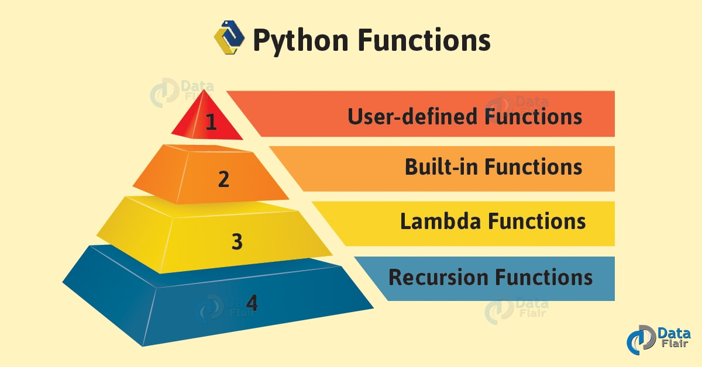
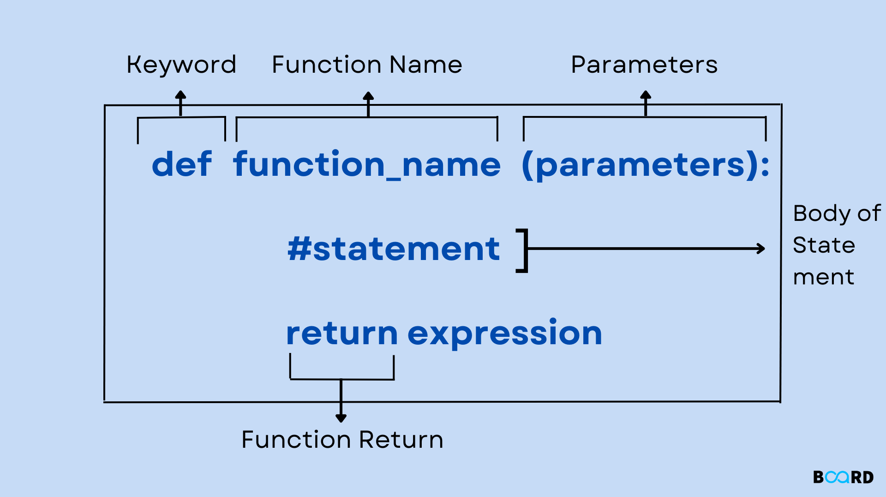
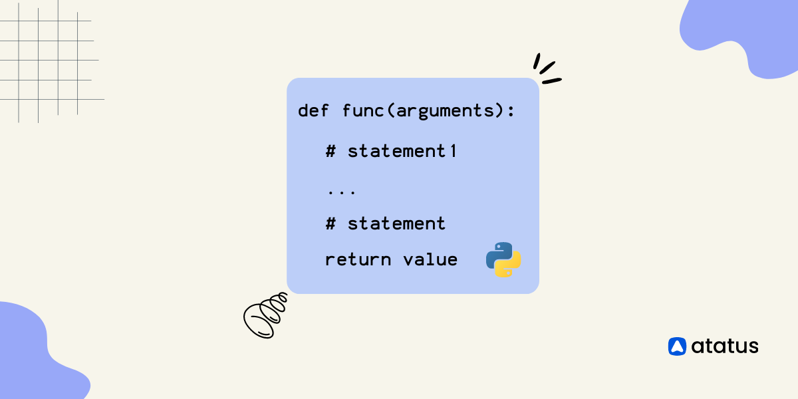
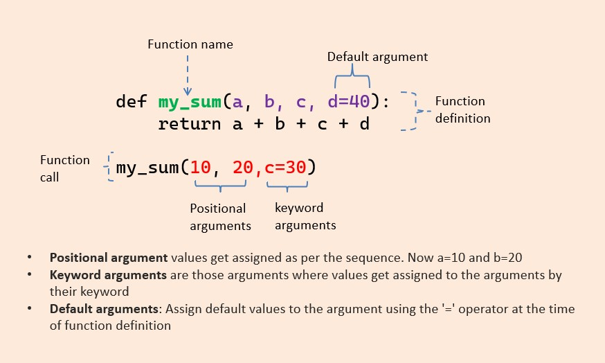
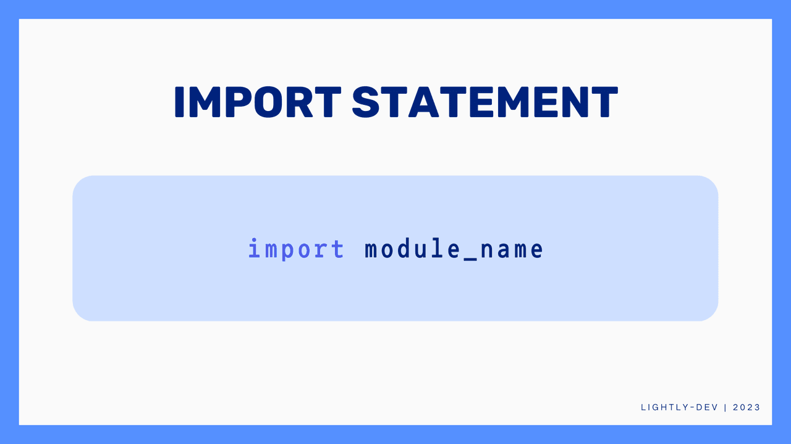
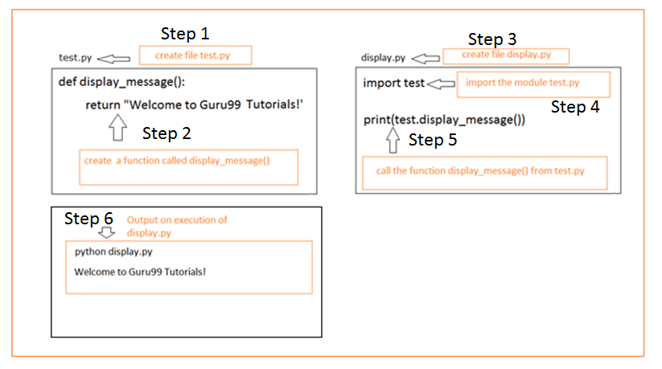

# 📢 Dot Net Learners House Meetup – Monthly Event - Apr 2025

## Date Time: 12-Apr-2025 at 09:00 AM IST

## Event URL: [https://www.meetup.com/dot-net-learners-house-hyderabad/events/306640169/](https://www.meetup.com/dot-net-learners-house-hyderabad/events/306640169/)


---

## **🎯 Goal of the Session**

By the end of this session, attendees will be able to:

- Understand how to define and use functions in Python using `def` and `return`.
- Differentiate between various types of function arguments, including default and keyword arguments.
- Import and use built-in Python modules such as `math` and `random`.
- Create and reuse custom modules for better code organization and modularity.

---

## *📝 Demo Script:*

### *Introduction (2 min)*

"Hi everyone! Glad to see you all here."
"Today, we’re jumping into a really important concept in **Python—Functions and Modules.**"
"We’ll begin by understanding how to define your own functions using def, and return values from them."
"Then we’ll look at how to work with different types of arguments, including default and keyword ones."
"After that, we’ll explore powerful built-in modules like math and random that save us tons of work."
"And to wrap it up, we’ll learn how to build our own custom modules to keep our code clean and reusable."
"By the end, you’ll be writing Python code that’s not just smarter, but also easier to manage."

---
# **Functions and Modules:**

A function in Python is a self-contained block of code designed to perform a specific task. Functions are one of the fundamental building blocks in Python and help in breaking down complex problems into smaller, manageable parts.

Functions promote code reusability, modularity, and organization. Instead of writing the same code again and again, we can define a function once and call it whenever needed.




### **Defining Functions (`def`, `return`)**

In Python, you define a function using the def keyword followed by a name, some parameters (if needed), and a colon. Inside the function, you write the code that you want it to run.



#### Syntax:
```python
def function_name(parameters):
    # code block
    return value
```

#### Example:
```python
def greet(name):
    return "Hello, " + name
```

This function takes a name as input and returns a greeting message. The `return` keyword is used to send back a result from the function.

---

### **Function Arguments and Return Values**


Functions become more powerful when you can give them different inputs and get useful results back. These inputs are called arguments, and you pass them inside the parentheses when you call the function.

Python allows functions to return one value—or even multiple values at once using a tuple. This helps you do more with less code.
#### Example:
```python
def calculate(a, b):
    return a + b, a * b
```

You can unpack the result as:
```python
sum_val, product_val = calculate(5, 3)
print("Sum:", sum_val)
print("Product:", product_val)
```

---

### **Default Parameters and Keyword Arguments**



Python gives you more control over function inputs using default and keyword arguments.

Default parameters allow you to set a value in case the caller doesn’t provide one. Keyword arguments let you specify values by their parameter name, making function calls more readable and flexible.

#### Example:
```python
def welcome(name, message="Welcome to Python!"):
    print(f"{name}, {message}")
```

Function calls:
```python
welcome("Alice")
welcome("Bob", message="Good to see you!")
```

This makes your function flexible and more readable.

---

### **Importing and Using Built-in Modules**

Python comes with a huge standard library—a collection of built-in modules ready to use. These modules provide tools to do complex tasks without writing everything from scratch.

You can import a module using the import statement and then use its functions with the module_name.function_name syntax.


#### Example:
```python
import math
import random

print("Square root of 64:", math.sqrt(64))
print("Random number between 1 and 10:", random.randint(1, 10))
```

These modules contain pre-defined functions and constants. You only need to import and use them.

---

### **Creating and Using Custom Modules**

When your code grows bigger, it’s a good idea to break it into smaller, manageable files. That’s where custom modules come in.

A custom module is just a .py file containing functions or variables you want to reuse. You can then import this module into other programs and use its content as needed.


#### Step 1: Create a module `myutils.py`
```python
def multiply(a, b):
    return a * b

def greet(name):
    return f"Hello, {name}"
```

#### Step 2: Use the module in another file
```python
import myutils

print(myutils.multiply(3, 4))
print(myutils.greet("Nikhil"))
```

Custom modules help organize code and promote reusability in larger projects.

---

"That’s all for today’s session. To recap, we covered how to define functions, use arguments and return values, work with default and keyword arguments, and import built-in and custom modules."

"With these concepts, you can now write cleaner, reusable, and modular Python code."

"Thank you for participating! Let's now move on to some practice exercises and live coding."

---
